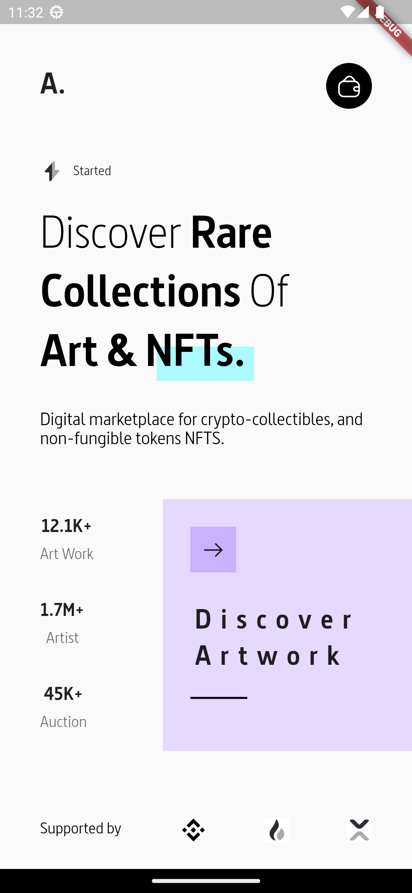
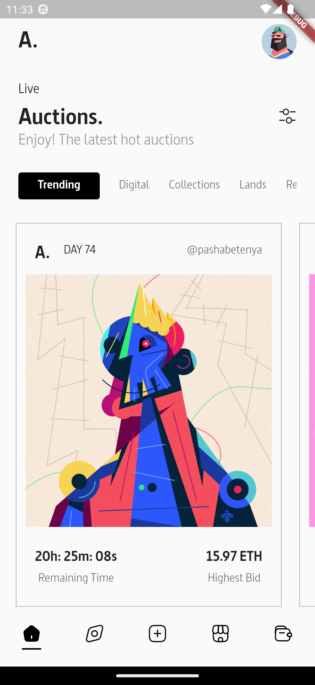
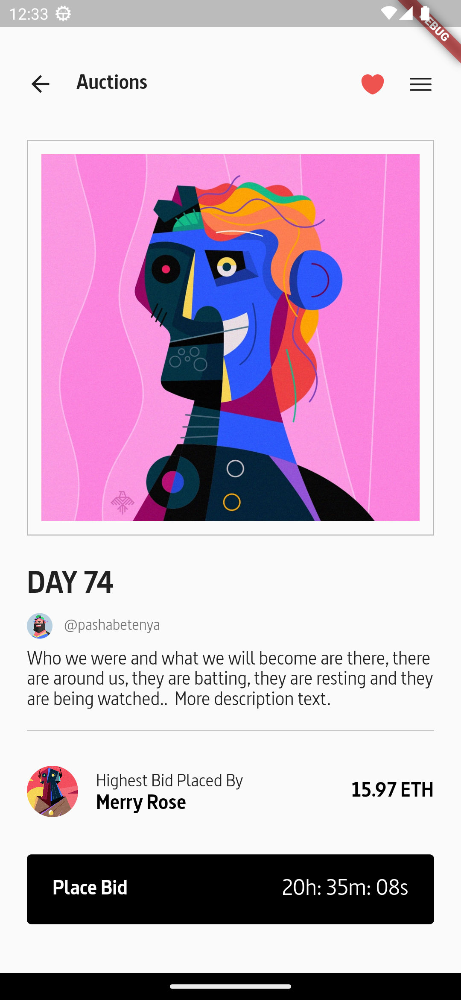

# Marketplace.

NFTs are trending right now, so why not make an awesome UI for an NFT Marketplace with Flutter?

## Getting Started.

This project is a starting point for a Flutter application.

How do I start it up?

Terminal:

```
- gh repo clone eextjcxltuires/Marketplace.
```

IDE VS Code:

```
file, pubspec.yaml:

- flutter pub get packages.
```

```
file, main.dart:

- flutter run.
```

### Review.

<table>
  <tr>
    <td>Anboarding Page.</td>
  </tr>
  <tr>
    <td></td>
  </tr>
 </table>

<table>
  <tr>
    <td>Home Page.</td>
    <td>Detail.</td>
  </tr>
  <tr>
    <td></td>
    <td></td>
  </tr>
 </table>
